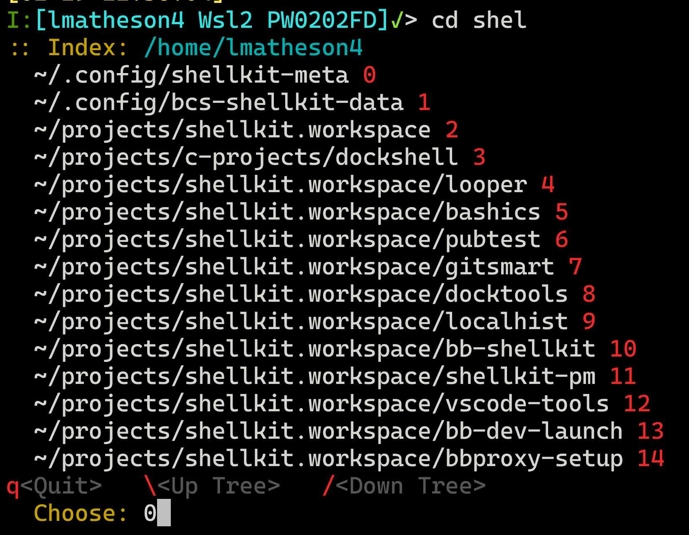

# `cd++`: turbo-charging the humble `cd` command

## Why is `cd` so dumb?
Linux/Unix users spend a *lot* of time changing directories.  Why isn't `cd` more helpful?  Why is there no "recent directories" list? *(There is, but it's hidden away and hard to discover and use)*  Why can't it keep track of my favorites?  Why do I spend so much time in a loop of "type a few chars, hit tab" until I get back to the same place I've been 100 times before?

While it's true that a single directory change is usually quick and relatively painless, there's two dark truths waiting to be noticed:

- One changes directories many times a day, often revisiting the same folders repeatedly.  This is annoying and more time-consuming than we'd like to admit.
- Some directories are buried deep in a tree and... tell me again why do I have to spend so much of my life seeking them out?

`cd++` is all about reducing the friction of the humble directory change command in `bash`.  It's not sexy, it doesn't involve machine learning or distributed edge-network content optimization.  Nobody ever got rich or famous by making it easier to change directories.  This is just a few simple observations, a bit of shell script and Python, and many years of suffering the annoyance of entering commands like this, over and over each day:

`cd ~/my-project/base/src/include/lxv/ver102-32992/imports/__generated__/foo`

## `cd++` to the rescue:

This tool replaces the default `cd` behavior with something that works the same way for the most common and ordinary cases, but has magical powers beyond that:

- Add a long dir to the index:
    ```console
    tjoe@my-pc:.../etc$  cd -a
    /home/tjoe/projects/fishhead/common/jsvsa/build/etc added/updated to /home/tjoe11/.tox-index:1
    ```
  Afterwards, you can go back to that dir with just `cd jsv` -- or any unique sequence of chars which match the directory name

- Quick resolution of ambiguous dir names:
  If you have multiple directories in your index which match the `cd [arg]` search text, **cd++** will present the choices and you can choose the correct one with minimal keyboard entry:

    </img>

- Many other handy features *(see [usage examples below](#usage-examples) or run `cd --help`)*

## Installation:

```
curl -L https://github.com/sanekits/cdpp/releases/download/1.0.0/cdpp-setup-1.0.0.sh \
    -o ~/tmp$$.sh && bash ~/tmp$$.sh && rm ~/tmp$$.sh
```


### Alternate method:

- Download the [latest version of `cdpp-setup-1.0.0.sh`](https://github.com/sanekits/cdpp/releases/latest)

- Run the self-extracting setup:
```console
user@laptop$ cd ~/Downloads && ./cdpp-setup-1.0.0.sh
```

### Configuration *(Optional)*
- Examine and  customize `~/.cdpprc` for config details

## How does it work?

There's four strategies combined in `cd++`:

- Be smart about `CDPATH` and have some helpers;
- Use `pushd` automatically when it makes sense to do so;
- Provide aliases to speed up dumb stuff *(e.g. `cd ../../../`)*;
- Use an index to track long/obscure paths that are often project-specific

For a user willing to do a bit of mindset-and-habit-changing, `cd++` can greatly reduce the effort spent moving around the file system, freeing up time for more interesting work.


## Usage examples:
- `cd /usr/bin` --> Nothing new here.  `cd` still works as expected, whenever practical.
- `cd Down<tab>` --> Issued from 10 levels deep, let's go up to **~/Downloads** without typing the `~/` or the full dir name.  Let `CDPATH` and autocomplete do what they're good at.
- `.3` --> Don't ever type `../../../` again.  There's aliases for `.1` thru `.6`.  *(Why isn't this built-in to `bash`?)*
- `dirs` --> List contents of bash `DIRSTACK` and choose one of the recent entries to go back there.
- `cd site nsmith` --> For more obscure *(but indexed!)* project-specific dirs, first do a smart search for `*site*` and then another smart search for the sub-indexed directory matching `*nsmith*`.  You can have as many indexes as you like.<br />The default top-level index is `~/.tox-index`.  You decide what gets indexed. If `cd` can't resolve its argument with `CDPATH`, it forwards the command to `tox`, which is a python-powered index search and maintenance utility.<br />  If `tox` finds multiple candidate matches, they're presented to the user for quick-pick menu selection.

## Also:

- `cd++` uses `pushd` automatically for "more distant" moves, so you can get back with `popd` *(or the alias `.p`)*
- `cd --help` can be used for quick command / option reminders
- `cdpath`, `cdpath_add`, and `cdpath_reset` streamline maintenance of `CDPATH`

## Tips:
- If you think `cd` is doing the wrong thing, run `builtin cd <args>` to see if `bash` agrees with you.
- `to` has its own `--help` and can be used independently of `cd++`
- The comments in `~/.cdpprc` can help you optimize for your working preferences.

