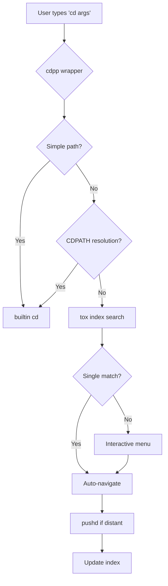
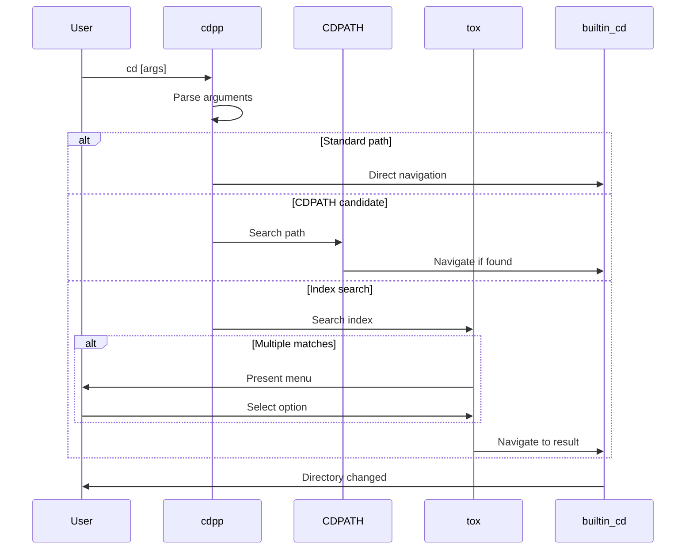
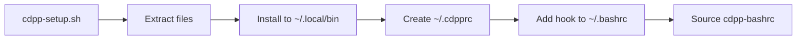
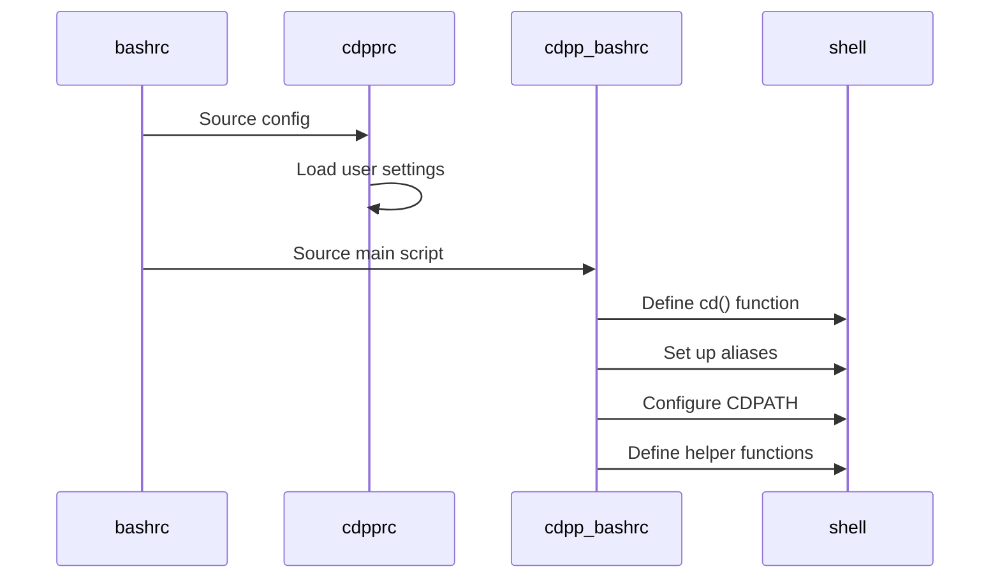
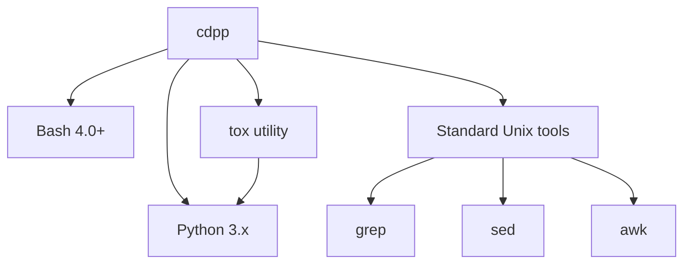
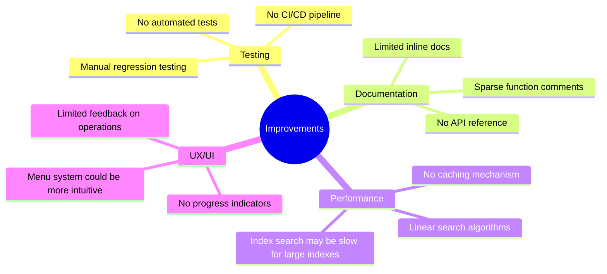

# cdpp Architecture Documentation

## 1. Operational Overview

cdpp enhances the Bash `cd` command by wrapping it with additional functionality. The system operates through several interconnected components:

### Core Components

### Key Behaviors

1. **Standard `cd` pass-through**: Simple paths like `cd /usr/bin` or `cd ../foo` work exactly as normal
2. **CDPATH enhancement**: Searches common directories without requiring full paths
3. **Smart pushd**: Automatically uses `pushd` for "distant" directory changes to maintain navigation history
4. **Index-based navigation**: Falls back to `tox` index search when CDPATH fails
5. **Interactive disambiguation**: Presents menu when multiple matches exist

### Command Flow

## 2. Installation and Shell Init

### Installation Process

### Components Installed

1. **`cdpp-bashrc`**: Main shell integration script
   - Defines the `cd` function wrapper
   - Sets up aliases (`.1`, `.2`, etc.)
   - Configures CDPATH helpers
   
2. **`tox`**: Python-based index search utility
   - Maintains directory index files
   - Performs fuzzy matching
   - Handles interactive menu selection

3. **`~/.cdpprc`**: User configuration file
   - Customizable behavior settings
   - Index file locations
   - Sourced by cdpp-bashrc

### Shell Initialization Sequence

### Key Initialization Steps

1. `.bashrc` sources `~/.cdpprc` (if exists)
2. `.bashrc` sources `cdpp-bashrc` from `~/.local/bin`
3. `cd` function is defined, shadowing builtin
4. Helper aliases created: `.1` through `.6`, `.p`, `..`, etc.
5. CDPATH helper functions: `cdpath`, `cdpath_add`, `cdpath_reset`
6. `dirs` wrapper for DIRSTACK management

## 3. Dependencies

### Runtime Dependencies

### Core Requirements

- **Bash 4.0+**: Required for associative arrays and modern syntax
- **Python 3.x**: Powers the `tox` index search utility
- **Standard Unix utilities**: grep, sed, awk for text processing

### Optional Dependencies

- **readline**: For interactive menu navigation (typically available)
- **Terminal colors**: For enhanced menu display (graceful degradation)

### Index Files

The system maintains index files for directory lookup:
- **`~/.tox-index`**: Default top-level directory index
- **Sub-indexes**: Project-specific indexes referenced from main index
- Format: Plain text, one directory path per line

## 4. Areas to Improve

### Code Quality Issues

1. **Shell Script Organization**
   - Mixed logic and configuration in single files
   - Limited function decomposition
   - Inconsistent error handling patterns
   - Missing shellcheck compliance in some areas

2. **Python Component (`tox`)**
   - Likely uses older Python 2.x patterns
   - May lack type hints
   - Error handling could be more robust
   - No unit tests apparent

### Functional Limitations

### Specific Improvement Areas

1. **Error Handling**
   - Inconsistent error message format
   - Silent failures in some code paths
   - No structured logging

2. **Testing Infrastructure**
   - No unit tests for shell functions
   - No integration tests for cd workflows
   - Manual testing only

3. **Documentation Gaps**
   - Function-level documentation sparse
   - No architecture diagrams (until now)
   - Configuration options not fully documented

4. **Performance Concerns**
   - Index searches may be O(n) for large indexes
   - No index caching or optimization
   - CDPATH evaluation could be slow with many entries

5. **Maintainability**
   - Magic numbers and strings throughout code
   - Global variables used extensively
   - Limited code reuse between components

6. **Security Considerations**
   - Path injection risks not fully mitigated
   - Index file permissions not validated
   - No sanitization of user input in some paths

### Modernization Priorities

1. **Immediate**
   - Add shellcheck compliance
   - Improve error handling consistency
   - Add function-level documentation

2. **Short-term**
   - Add bats testing framework
   - Refactor large functions into smaller units
   - Modernize Python code (type hints, f-strings)

3. **Long-term**
   - Consider caching layer for index searches
   - Explore alternative index formats (JSON, SQLite)
   - Add configuration validation
   - Implement proper logging framework

### Known Bugs and Quirks

- Handling of paths with special characters may be inconsistent
- Race conditions possible with concurrent index updates
- DIRSTACK size limits not enforced
- Menu selection may have issues with large result sets
- Symlink resolution behavior undefined in some cases

## Component Details

### The `cd` Function Wrapper

The core `cd` function intercepts all directory change commands and applies logic to determine the appropriate action:

1. Parse arguments for special flags (`-a`, `--help`, etc.)
2. Check if argument is a simple/standard path
3. Attempt CDPATH resolution
4. Fall back to `tox` index search
5. Determine if `pushd` should be used (based on "distance")
6. Execute the actual directory change
7. Update index if needed

### The `tox` Utility

Python script that manages the directory index:

- **Search**: Fuzzy matching against index entries
- **Add/Update**: Maintain index entries (`cd -a`)
- **Interactive Menu**: Present choices when ambiguous
- **Sub-index Support**: Handle hierarchical index structures

### Helper Aliases and Functions

- **`.1` - `.6`**: Navigate up 1-6 directory levels
- **`.p`**: Alias for `popd`
- **`cdpath`**: Show current CDPATH
- **`cdpath_add`**: Add directory to CDPATH
- **`cdpath_reset`**: Reset CDPATH to defaults
- **`dirs`**: Enhanced DIRSTACK viewer with selection
